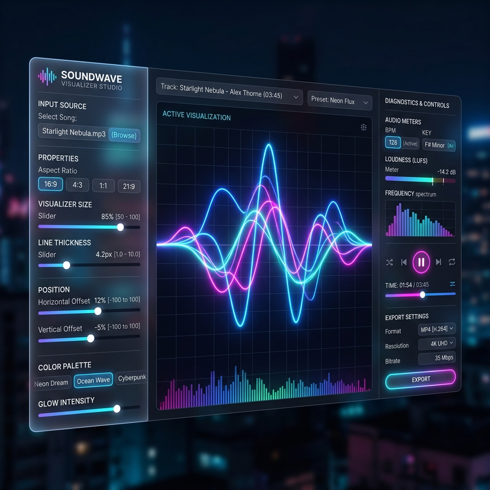

# 🎵 Soundwave Visualizer & Video Studio

A premium, hardware-accelerated Windows desktop application to design stunning, high-fidelity audio visualizers and export them as fluid, frame-perfect music videos.



---

## 🌟 Key Features

### 1. 15 Premium Visualizer Designs
Equipped with 15 custom mathematical frequency and time-domain visualizer modules, including:
*   **AI Voice Assistant Wave**: Premium voice assistant wave utilizing **7 overlapping mathematical Gabor curves** blending additively (`lighter` composite blend mode) with multi-colored neon gradients (Aqua, Fuchsia, Purple, Emerald, Blue, Gold, White) and a gentle glowing dormant baseline that breathes when silent (**Shutterstock ID 2435987339**).
*   **Orbital Voice Blobs**: Siri/Google-style glowing blobs that dynamically scale, separate, and morph in response to treble peaks and overall volume (**Shutterstock ID 2416549429**).
*   **Fluid Wave Curves**: Continuous liquid-like undulating Bezier curves with mirrored transparent shadow waves flowing across the screen.
*   **Digital Matrix HUD**: Futuristic digital block matrix grid frequency analyzer.
*   **Digital Water Ripple**: Mimics concentric ripples expanding outward from a central pulsing liquid droplet, accompanied by floating particles curving in dynamic wave-like trajectories (**Shutterstock ID 2653154933**).
*   **Volumetric Glow Ribbon**: Overlapping, ultra-smooth wavy horizontal ribbons creating a volumetric 3D-looking soundwave belt (**Shutterstock ID 2770068617**).
*   **Equalizer Wave Ribbons**: Translucent multi-layered vertical wave ribbons (Fuchsia, Cyan, Emerald, Amber) filled with bright linear gradients that bounce to distinct frequency bands (**Shutterstock ID 1925468375**).
*   **Digital Matrix Sphere**: A gorgeous 3D rotating spherical network lattice of interconnected nodes that expands and glows intensely to specific frequency ranges (**Shutterstock ID 2419414219**).
*   **Neon Fiber Wavefront**: A hyper-dense pack of 45 ultra-thin glowing threads weaving together into a cosmic fiber bundle that wiggles and warps in response to high-frequency transients (**Shutterstock ID 2174901063**).
*   **Circular Ripple Rings**: Concentric radial frequency bars extending from a glowing circular base. The base radius pulses in sync with the bass, and peak frequencies emit glowing particle sparks.
*   **Neon Oscilloscope**: Raw time-domain green light waveform beam.
*   **3D Wireframe Orbit**: 3D rotated perspective concentric rings warping dynamically to bass and treble frequencies.
*   **Mirrored Wave Borders**: Symmetrical glowing wave boundaries placed at the top and bottom of the frame for elegant edge framing.
*   **Glowing Linear Bars**: Classic neon frequency spectrum bars equipped with peak level falling indicator dots (increased density to 120 lines).
*   **Radial Starburst Particles**: Emits hundreds of starry glowing particles floating from the center outward, whose speed and size scale with the bass kicks.

### 2. Custom Layout & Styling Panels
*   **Position & Size Sliders**: Precision sliders for *Size Scale*, *X-Position (Horizontal Offset)*, and *Y-Position (Vertical Offset)* to place the visualizer anywhere on screen.
*   **Custom Overlays**: Toggle glowing titles, artist tags, diagnostic BPM tags, and live bass peak meters.
*   **Dynamic Backgrounds**: Load custom background images (PNG, JPG, WebP) directly from your files.
*   **Aspect Ratio Toggle**: Render in Widescreen (16:9) or Vertical (9:16) for YouTube Shorts, TikTok, and Instagram Reels.

### 3. Frame-Perfect Video Exporter
*   **Deterministic advance**: Uses a locked step timer `visualizerTime` rather than wall-clock time. This guarantees that even if your computer lags during high-DPI rendering and video recording, the exported MP4/WebM file remains **absolutely fluid, skip-free, and perfectly in sync at 30 FPS or 60 FPS**.
*   **Digital Streaming**: Streams high-fidelity digital audio combined with high-DPI canvas frames directly to local storage.

### 4. Zero Installation Portable Build
*   Runs instantly with **no installer, setup screens, or administrator access** required.

---

## 🚀 How to Run (Download & Go)

### Method A: Download the ZIP (Recommended)
1. Go to the [**GitHub Releases**](https://github.com/vkmr007/soundwave-visualizer/releases) page.
2. Download **`SoundwaveStudio-portable-win-x64.zip`** (Version 1.0.2 is under 100MB!).
3. Extract the ZIP anywhere on your Windows PC.
4. Double-click **`SoundwaveStudio.exe`** to launch!

### Method B: Clone the Repository
1. Clone this repository to your local machine.
2. Open the repository folder.
3. Navigate to **`dist/SoundwaveStudio-win32-x64`**.
4. Double-click **`SoundwaveStudio.exe`** to run the app directly!

---

## 🛠️ Developer Setup & Rebuilding

If you want to run the project in development mode or compile it yourself:

### 1. Install Dependencies
Make sure you have Node.js installed, then run:
```powershell
npm install
```

### 2. Run in Dev Mode (Hot Reload UI)
To launch the Electron app with live console diagnostics:
```powershell
npm start
```

### 3. Build & Optimize Portable Package
To compile a fresh Windows build, optimize its size (stripping unused translation files to keep it under 100MB), and generate a new ZIP package:
```powershell
npm run package
```
This runs the automated build script located at `scripts/build.js`.

---

## 📁 Project Structure

*   `main.js`: Main desktop process handling native Windows bridges, hardware acceleration, and direct stream saving.
*   `preload.js`: Secure IPC context bridge interfacing renderer logic with the Windows filesystem.
*   `src/index.html`: Modern Glassmorphic control dashboard and live renderer canvas.
*   `src/style.css`: Sleek responsive dashboard stylesheet equipped with glowing visual cues.
*   `src/app.js`: Audio Analyser, visual preset mathematical curves, and MediaRecorder stream capture.
*   `scripts/build.js`: Automated optimization and build post-processing pipeline.
